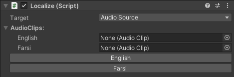
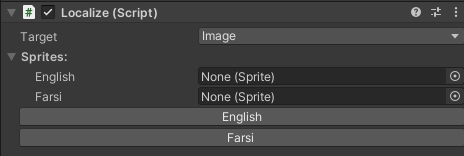

# Localization-System
Localization System for Unity can be used for both RTL and LTR languages, images, audios, fonts and etc, based on CSV file.
You can use your desired outline for the texts and also add strings to the predefined localization texts dynamically.

---
- [Installation](#installation)
- [Documentation](#documentation)
	- [How to Start](#how-to-start)
	- [Localization Targets](#localization-targets)
		- [RTLTextMeshPro](#rtltextmeshpro)
		- [AudioSource](#audiosource)
		- [Image](#image)
- [Maintainer](#Maintainer)
---

# Installation

In order to use this system inside your unity project, you can either download it from the [Releases](https://github.com/SMahdiFaghih/Localization-System/releases) page and import it from Assets > Import Package > Custom Package...
Or clone the project and copy all its content into your project.

# Documentation

## How to Start

All files of this localization system can be found in Assets > Scripts > Localziation.

Open Enums.cs script. There are two enums in it which determines the languages and the outlines. You need to add your desired language or outline into these enums in order to use them in the rest of the system.

Create an empty game object and add LocalizationManager script to it. In the inspector and for LocalizationManager component, you'll see the empty slots for the enum values that mentioned before, that you can select or drag and drop the FontAsset files and Text Materials (for outline) in there.

Add Localize script as a component to the Game object that you want to change one of its other components by localization. You can add multiple Localize components for different targets. (We'll discuss about all these targets later)

Then, from the inspector, choose the target component from the drop-down menu in the Localize component.
The rest of the component view in editor will change according to the target and will allow you to set your desired settings and files for that target.
For all the targets there are buttons for every language you mentioned in LocalizedLanguage.cs Enum and by clicking on them you can see the preview of the localization of that target for that language in the Edit mode.

## Localization Targets

### RTLTextMeshPro

### AudioSource

if you choose AudioSource as the target, localize component will look like the image below. You can set your desired AudioClips for every language and it will be set as the audioSource's audioClip on Start.

Remember that this only works if Localize and AudioSource components are attached to the same gameObject.

### Image

if you choose Image as the target, localize component will look like the image below. You can set your desired Sprites for every language and it will be set as the image's sprite on Start.

Remember that this only works if Localize and Image components are attached to the same gameObject.

----

# Maintainer

- [Seyyed Mahdi Faghih](https://github.com/SMahdiFaghih)
