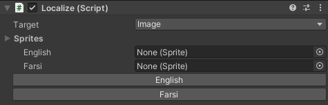

# Localization-System
Localization System for Unity can be used for both RTL and LTR languages (based on CSV file). You can use your desired outline for the texts and also add strings to the predefined localization values dynamically.

 You can also use this system to apply localization to **Images, AudioSources, LayoutGroups** and **RectTrasnforms**.

---
- [Installation](#installation)
- [Documentation](#documentation)
	- [How to Start](#how-to-start)
	- [Define a new Language](#define-a-new-language)
	- [Localization Targets](#localization-targets)
		- [RTLTextMeshPro](#rtltextmeshpro)
			- [First looks at CSV file](#first-looks-at-csv-file)
			- [Add/Edit a LocalizedText](#addedit-a-localizedtext)
		- [AudioSource](#audiosource)
		- [Image](#image)
		- [GridLayoutGroup](#gridlayoutgroup)
		- [HorizontalOrVerticalLayoutGroup](#horizontalorverticallayoutgroup)
		- [RectTransform](#recttransform)
- [Maintainer](#Maintainer)
---

# Installation

In order to use this system inside your unity project, you can either download it from the [Releases](https://github.com/SMahdiFaghih/Localization-System/releases) page and import it from Assets > Import Package > Custom Package...
Or clone the project and copy all the assets folder content into your project.

# Documentation

## How to Start

All files of this localization system can be found in **Assets > Scripts > Localization**.

Open Enums.cs script. There are two enums in it which determines the languages and the outlines. You need to add your desired language or outline into these enums in order to use them in the rest of the system.

Create an empty game object and add **LocalizationManager** script to it. In the inspector and for LocalizationManager component, you'll see the empty slots for the enum values that mentioned before, that you can select or drag and drop the FontAsset files and Text Materials (for outline) in there.

Add **Localize** script as a component to the Game object that you want to change one of its other components by localization. You can add multiple Localize components to the same GameObject for different targets. (We'll discuss about all these **Targets** later)

The word Target, means the component that you want to change its properties using Localization and for different languages. For example if you want to change the sprite of an image, your target should be Image.

From the inspector, choose the target component using the drop-down in the Localize component.
The rest of the component's view in editor will change according to that target and will allow you to set your desired settings and files for that target.

For all the targets there are buttons for every language you mentioned in LocalizedLanguage.cs Enum and by clicking on them you can see the preview of applying the localization of that target for that language in the Edit mode.

## Define a new Language

If you want to define a new language, you just have to do the two followings:

* Add it to LocalziationLanguage enum is Enums.cs file.
* follow the Localziation.csv pattern and add it to the first row of it. (For more information read [this](#first-looks-at-csv-file) part of this document)

## Localization Targets

### RTLTextMeshPro

if you choose RTLTextMeshPro as the target, localize component will look like the image below. Then you can use your predefined key so that its value for the current language will be set as your text on Start. Don't worry i will explain everything about this key-value thing :)

Remember that this only works if Localize and RTLTextMeshPro components are attached to the same gameObject.

### First looks at CSV file

In order to use a text in different languages, first you have to define it in the Localization.csv file. You can find it in **Assets > Resources > Localization**.

Every row of this file consists of some texts surrounded by double-quotes and separated by comma. The first row of has the headers of every column and the rest of it consists of a key and some texts for every language. Note that the Localziation System uses this key and the current selected language to set the text value of RTLTextMeshPro component.

### Add/Edit a LocalizedText

In order to add a new localized text, you have to first, specify a key and the value of it for every language. Then you need to do just one of the followings:

* Open the Localization.csv file as a plain text, follow its pattern and add/edit your key and values to a new row.
* Open the Localization.csv file as in LibreOffice or similar applications and add/edit your key and values to a new row. (Make sure that the saving methods of that application follows our pattern, otherwise it won't work.)
* Use the ability of this system to add/edit your key and values using the inspector. In the Localize component there is a '+' button. Click on it and you'll see a window like the image below that you can add/edit your key and values there. Note that you should first type in the key and then the values. If the key is repetitive, the value textFields will be filled with its current values. You can also use this window to edit your previously added values (but not the key).

* 

### AudioSource

if you choose AudioSource as the target, localize component will look like the image below. You can set your desired **AudioClips** for every language and it will be set as the audioSource's audioClip on Start.

Remember that this only works if Localize and AudioSource components are attached to the same gameObject.

### Image

if you choose Image as the target, localize component will look like the image below. You can set your desired **Sprites** for every language and it will be set as the image's sprite on Start.

Remember that this only works if Localize and Image components are attached to the same gameObject.

### GridLayoutGroup

if you choose GridLayoutGroup as the target, localize component will look like the image below. For every language there are two drop-downs to set your desired **StartCorner** and **ChildAlignment**. These are the same enums that the original GridLayoutGroup component uses them.

Remember that this only works if Localize and GridLayoutGroup components are attached to the same gameObject.

### HorizontalOrVerticalLayoutGroup

if you choose HorizontalOrVerticalLayoutGroup as the target, localize component will look like the image below. This works for both **HorizontalLayoutGroup** and **VerticalLayoutGroup** targets and for every language you have to set two properties. First is **ChildAlignment** and the second one is **ReverseArrangement**. These two are the exact values that those LayoutGroup components has them and you can use them to set the behaviour of the LayoutComponent for every language.

Remember that this only works if Localize and HorizontalLayoutGroup (or VerticalLayoutGroup) components are attached to the same gameObject.

### RectTransform

if you choose RectTransform as the target, localize component will look like the image below. For every language there is a button which by pressing on it, Localize script will store the properties (only **AnchoredPosition** and **SizeDelta**) of the RectTrasnform component.

Note that you can only use it to adjust the **Position** of your gameObject. All you need to do is to move your gameObject to the desired position and click on this button.

Remember that this only works if Localize and RectTransform components are attached to the same gameObject.

----

# Maintainer

- [Seyyed Mahdi Faghih](https://github.com/SMahdiFaghih)
